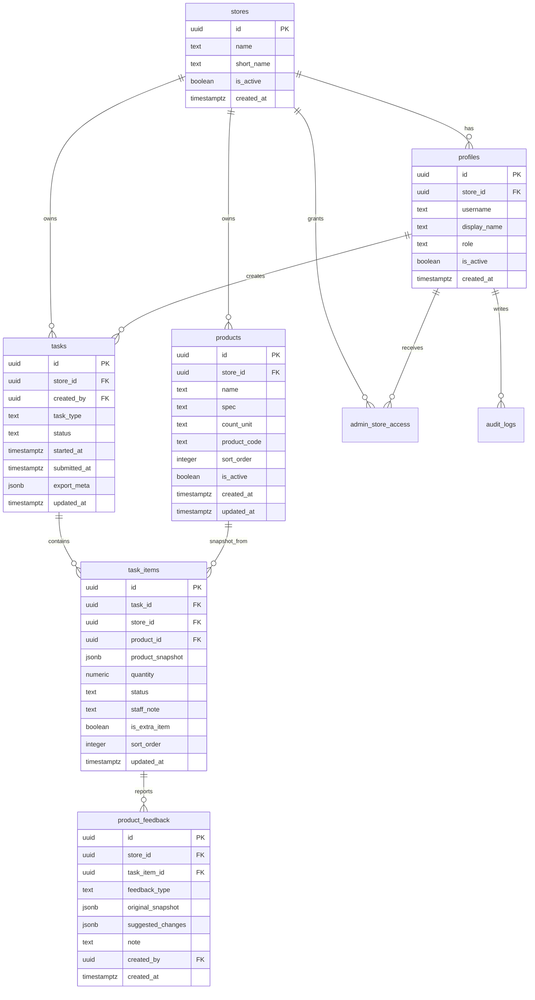

# 数据库与 RLS 方案

## StoreHub V2 到货数据库

V2 阶段 2 新增 `arrival_reports`、`arrival_report_items`、`arrival_report_images` 和 `notifications`，对应 migration 为 `supabase/migrations/0010_arrival_reports.sql`。到货模块使用独立表和权限函数，不修改 V1 点货/订货的 `tasks`、`task_items` 逻辑。

`0012_arrival_report_returning_rls.sql` 将到货主表 SELECT policy 改为直接校验当前行的门店、角色、状态和提交人，避免 PostgREST 创建草稿并返回新行时因策略自查询尚不可见的新记录而错误拒绝请求。门店隔离规则不变。

完整的表、索引、RPC、RLS、私有 Storage 和回滚说明见 `docs/V2_PHASE_2_DATABASE.md`。

## 多门店账号

- `profile_store_access` 保存账号可以访问的全部门店。
- `profiles.store_id` 保存账号当前选中的门店，点货、订货和草稿均使用该门店。
- `switch_current_store` 仅允许账号切换到自己已有权限的启用门店。
- 删除账号使用 `profiles.deleted_at` 和 Auth 软删除，避免破坏历史任务的提交人引用。

## ER 设计

## 枚举约束

- `profiles.role`: `staff`, `manager`, `admin`
- `tasks.task_type`: `inventory`, `order`
- `tasks.status`: `draft`, `review`, `submitted`, `cancelled`
- `task_items.status`: `pending`, `completed`, `no_order_needed`
- `product_feedback.feedback_type`: `discontinued`, `incorrect`, `new`

## RLS 权限矩阵

| 对象 | staff | manager | admin |
|---|---|---|---|
| stores | 只能读自己的门店 | 只能读自己的门店 | 可读被授权门店 |
| profiles | 读自己的资料 | 读本店资料 | 读被授权门店资料 |
| products | 读本店启用商品 | 读本店商品；可通过受控事务函数更正资料 | 管理被授权门店商品；审批删除或撤回修改 |
| draft tasks | 管理自己创建且未提交的本店任务 | 管理本店任务 | 管理被授权门店任务 |
| submitted tasks | 只读自己提交记录 | 只读本店历史 | 只读/导出被授权门店历史 |
| task_items | 跟随 task 权限 | 跟随 task 权限 | 跟随 task 权限 |
| product_feedback | 创建本店反馈 | 创建本店修改通知和删除申请 | 查看并审批被授权门店反馈 |
| audit_logs | 创建自己的日志 | 查看本店日志 | 查看被授权门店日志 |

## RLS 实现原则

- 使用 `auth.uid()` 绑定 `profiles.id`。
- 普通用户和店长通过 `profiles.store_id` 判断门店边界。
- 管理员通过 `admin_store_access` 判断可访问门店，不默认拥有所有门店。
- 已提交任务不可由普通员工更新。
- URL 篡改或直接调用 Supabase API 仍由 RLS 阻断。
- 店长商品更正通过 `manager_update_product_from_task` 原子更新商品、任务快照、反馈通知和审计日志。
- 店长删除申请通过 `manager_request_product_deletion` 创建待审批记录，不直接删除商品。
- 管理员通过 `admin_handle_product_feedback` 确认删除、忽略、知晓或撤回；删除商品时历史 `task_items.product_id` 自动置空，`product_snapshot` 保留。
- 店长通过 `manager_add_product_from_task` 原子创建商品主数据、当前任务项、新增通知和审计日志；直接插入商品的 RLS 权限仅保留给管理员。
- 加载未提交草稿时会对比当前启用商品并补齐缺少的任务项，避免新增商品因旧草稿快照而不可见。
- `task_items.product_action_status` 持久化删除申请、确认和忽略状态；删除反馈触发器同步调整任务项是否属于待盘点。
- `list_store_inventory_templates` 仅返回当前账号所属门店的历史盘点预览；`import_inventory_task` 只允许员工或店长把同店已提交盘点单导入自己的未提交草稿。
- 导入脚本如需 service role，应只在受控环境运行，不进入前端。

## 迁移文件

初始 SQL 草案位于：

- `supabase/migrations/0001_initial_schema.sql`

阶段 2 已补充：

- `supabase/seed.sql`：两家门店和脱敏商品测试数据。
- `src/types/database.ts`：前端使用的 Supabase 数据库类型。
- `scripts/validate-supabase-schema.mjs`：静态检查表结构、RLS、策略和 seed。

真实 Supabase 项目创建后仍需要执行迁移，并用不同 Auth 用户 token 补充 RLS 集成测试。
