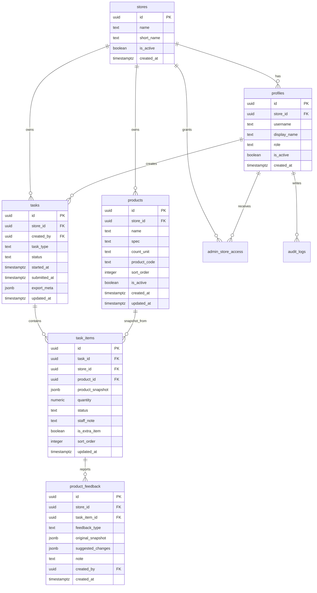

# 数据库与 RLS 方案

## StoreHub V2 到货数据库

V2 阶段 2 新增 `arrival_reports`、`arrival_report_items`、`arrival_report_images` 和 `notifications`，对应 migration 为 `supabase/migrations/0010_arrival_reports.sql`。到货模块使用独立表和权限函数，不修改 V1 点货/订货的 `tasks`、`task_items` 逻辑。

`0012_arrival_report_returning_rls.sql` 将到货主表 SELECT policy 改为直接校验当前行的门店、角色、状态和提交人，避免 PostgREST 创建草稿并返回新行时因策略自查询尚不可见的新记录而错误拒绝请求。门店隔离规则不变。

完整的表、索引、RPC、RLS、私有 Storage 和回滚说明见 `docs/V2_PHASE_2_DATABASE.md`。

## StoreHub V2 任务模板

阶段 5 使用 `v2_task_templates`、适用门店、分组、项目和版本五张独立表，不修改 V1 `tasks` 与 `task_items`。管理员通过安全定义者 RPC 保存、发布和归档；员工和店长只能读取当前门店已发布模板。发布版本保存完整 JSON 快照，供阶段 6 的任务实例固定引用。

对应 migration 为 `0013_v2_task_templates.sql`、`0014_v2_task_template_privileges.sql` 和 `0015_v2_task_template_archive_audit.sql`，完整说明见 `docs/V2_PHASE_5_TASK_TEMPLATES.md`。

阶段 6 的 `0016_v2_task_execution.sql` 新增任务实例、答案、图片元数据和审核记录，并使用模板版本 JSON 快照创建任务。核心状态写入只通过发布、保存、提交和审核 RPC，图片存放于私有 `v2-task-images` bucket。

## 多门店账号

- `profile_store_access` 保存账号可以访问的全部门店。
- `profiles.store_id` 保存账号当前选中的门店，点货、订货和草稿均使用该门店。
- `switch_current_store` 仅允许账号切换到自己已有权限的启用门店。
- 删除账号使用 `profiles.deleted_at` 和 Auth 软删除，避免破坏历史任务的提交人引用。

## ER 设计

## 枚举约束

- `profiles.role`: `staff`, `manager`, `admin`
- `tasks.task_type`: `inventory`, `order`
- `tasks.status`: `draft`, `review`, `submitted`, `cancelled`
- `task_items.status`: `pending`, `completed`, `no_order_needed`
- `product_feedback.feedback_type`: `discontinued`, `incorrect`, `new`

## RLS 权限矩阵

| 对象 | staff | manager | admin |
|---|---|---|---|
| stores | 只能读自己的门店 | 只能读自己的门店 | 可读被授权门店 |
| profiles | 读自己的资料 | 读本店资料 | 读被授权门店资料 |
| products | 读本店启用商品 | 读本店商品；可通过受控事务函数更正资料 | 管理被授权门店商品；审批删除或撤回修改 |
| draft tasks | 管理自己创建且未提交的本店任务 | 管理本店任务 | 管理被授权门店任务 |
| submitted tasks | 只读自己提交记录 | 只读本店历史 | 只读/导出被授权门店历史 |
| task_items | 跟随 task 权限 | 跟随 task 权限 | 跟随 task 权限 |
| product_feedback | 创建本店反馈 | 创建本店修改通知和删除申请 | 查看并审批被授权门店反馈 |
| audit_logs | 创建自己的日志 | 查看本店日志 | 查看被授权门店日志 |

## RLS 实现原则

- 使用 `auth.uid()` 绑定 `profiles.id`。
- 普通用户和店长通过 `profiles.store_id` 判断门店边界。
- 管理员通过 `admin_store_access` 判断可访问门店，不默认拥有所有门店。
- 已提交任务不可由普通员工更新。
- URL 篡改或直接调用 Supabase API 仍由 RLS 阻断。
- 店长商品更正通过 `manager_update_product_from_task` 原子更新商品、任务快照、反馈通知和审计日志。
- 店长删除申请通过 `manager_request_product_deletion` 创建待审批记录，不直接删除商品。
- 管理员通过 `admin_handle_product_feedback` 确认删除、忽略、知晓或撤回；删除商品时历史 `task_items.product_id` 自动置空，`product_snapshot` 保留。
- 店长通过 `manager_add_product_from_task` 原子创建商品主数据、当前任务项、新增通知和审计日志；直接插入商品的 RLS 权限仅保留给管理员。
- 加载未提交草稿时会对比当前启用商品并补齐缺少的任务项，避免新增商品因旧草稿快照而不可见。
- `task_items.product_action_status` 持久化删除申请、确认和忽略状态；删除反馈触发器同步调整任务项是否属于待盘点。
- `list_store_inventory_templates` 仅返回当前账号所属门店的历史盘点预览；`import_inventory_task` 只允许员工或店长把同店已提交盘点单导入自己的未提交草稿。
- 导入脚本如需 service role，应只在受控环境运行，不进入前端。

## 迁移文件

初始 SQL 草案位于：

- `supabase/migrations/0001_initial_schema.sql`

阶段 2 已补充：

- `supabase/seeds/development.sql`：仅供独立开发测试 Supabase 使用的脱敏数据，正式环境禁止执行。
- `src/types/database.ts`：前端使用的 Supabase 数据库类型。
- `scripts/validate-supabase-schema.mjs`：静态检查表结构、RLS、策略和 seed。

所有数据库改动只通过 `supabase/migrations` 管理，并先应用到开发测试项目。双环境发布顺序与安全门禁见 `docs/ENVIRONMENT_ISOLATION.md`。

## 钉钉考勤模块

`0050_dingtalk_attendance.sql` 新增钉钉员工目录、人工确认绑定、日考勤、打卡流水、同步任务、失败项和审计日志。日记录和打卡流水使用第三方稳定 ID 唯一约束保证 Upsert 幂等；月度摘要由安全调用者权限的 View/RPC 聚合。

考勤 RLS 独立于普通业务门店管理权限：员工和店长只能读本人，管理员只能读其现有授权门店，浏览器无考勤表写权限。接入和同步设计见 `docs/DINGTALK_ATTENDANCE_SETUP.md` 与 `docs/DINGTALK_ATTENDANCE_SYNC.md`。

## 收银营业收入同步

`0068_pos_sales_revenue_sync.sql` 新增收银系统门店映射、更新计划、同步任务和最小化单据表，并为每日营业收入增加来源追踪。管理员只能管理授权门店的连接计划与读取同步日志；浏览器不能读写标准化单据，只有后端 Service Role 可用事务函数替换某门店某日单据并刷新营业收入。

`0070_monthly_revenue_sources.sql` 新增门店截止日期营业额来源表。提成计算会按门店选择使用“本月每日营业额合计”或“管理员手动设置的本月累计营业额”，不会把单日营业额误当整月基数，也不会同时叠加两个来源。银豹月累计同步由 Service Role 在事务中替换所选月区间的标准化单据，并为无单据日期写入零值确认记录。

`0071_full_attendance_bonus.sql` 为员工工资规则增加可选全勤奖开关和金额，并包装实时薪资计算：累计出勤达到当月满勤天数后，全勤奖自动并入累计绩效奖和薪资合计。员工工资参数继续按生效日期保留历史。

`0078_payroll_payslips.sql` 新增不可变工资单快照、员工确认状态与 RLS；管理员可手动发放，`pg_cron` 每日北京时间 00:10 检查并仅在每月 1 日自动发放上月工资单。未确认工资单直接参与待办统计，确认 RPC 同步完成待办并标记对应通知已读。

`0079_payroll_payslip_draft_workflow.sql` 将管理员手动工资单改为草稿、发送、确认、撤回四态流程。草稿通过 RLS 对员工隐藏；发送才生成通知与待办。管理员可修改金额和备注，修改已确认工资单会清除原确认并要求员工重新确认，撤回则同步移除员工通知和待办。

`0080_payroll_extra_awards_and_history_fix.sql` 为员工工资规则增加额外奖励，实时工资按“超过全勤标准的天数 × 300 元”独立计算超勤奖。管理员可在员工参数或工资单中调整额外奖励。该迁移同时修复历史月份早于绩效规则建档日期时整条员工计算结果被交叉连接过滤的问题：历史考勤采用最近可用的工资与绩效配置计算，员工姓名和已知工资不再被清空。

`0081_payroll_issue_normalization.sql` 统一最终工资完整状态和待完善原因；下游规则已经消除的临时问题不再继续显示，真正缺少历史营业收入时仍明确提示提成尚未计入。

`0082_payroll_historical_employee_scope.sql` 修正管理员查看历史月份时的员工范围：只展示当月已经建档或存在考勤记录的员工，避免后来创建且当月没有考勤的账号混入历史工资列表；钉钉导入的历史考勤员工仍正常保留。

`0083_payroll_function_volatility.sql` 将工资聚合函数调整为符合其真实读数行为的 `VOLATILE`，避免考勤、营业收入或工资规则在同一事务内更新后仍被错误地按稳定函数处理。

`0084_payroll_tax_performance_override_and_deductions.sql` 为员工工资规则增加绩效自动计算/强制覆盖配置，为工资单增加个税扣除，并提供按权限读取员工罚款明细的 RPC。实时薪资和工资单快照同步保存扣款合计、个税与逐笔扣款数据，员工只能查看本人明细，管理员只能查看授权门店人员。

`0072_payroll_revenue_carry_forward.sql` 调整提成数据完整性口径：所选截止日期没有当天收入时，按门店沿用同一自然月内最近一次手动累计基数，或累计到最近一次收银同步日期的每日营业额。返回值同时标明基数有效日期，且不会跨月沿用。

收银平台 App ID、App Key 不进入数据库业务表、前端环境变量或 Git，只存放在对应 Supabase 环境的 Edge Function Secret。开发与正式环境必须分别设置各自 Secret，并依照 `docs/POS_SALES_SYNC.md` 的顺序先验证 Migration、再部署函数和前端。
